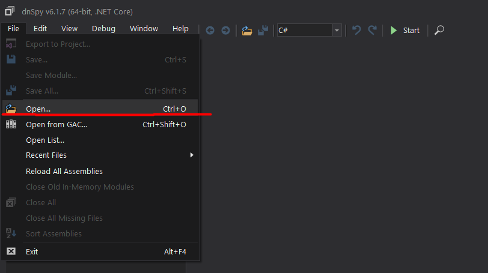

# HowToTranslateMods
Maybe a bit silly but working method to translate mods

1. Download dnSpy then run `dnSpy.exe`
2. Open mod's `.dll` file 
    
3. Expand assembly  then search for the part of the code which responsible for rendering 
4. Find some text that you want to translate 
5. Right click on the line where this text located then select `Edit IL Instructions..` 
6. Replace it with translated text and click `OK`  . You'll see that text has changed 
7. Save changes 
    - click `ok` on this screen 
    
8. Profit 

## Important moment
As wee see above, our translated text can overflow

To resolve this you can change size of the view on which text located  
